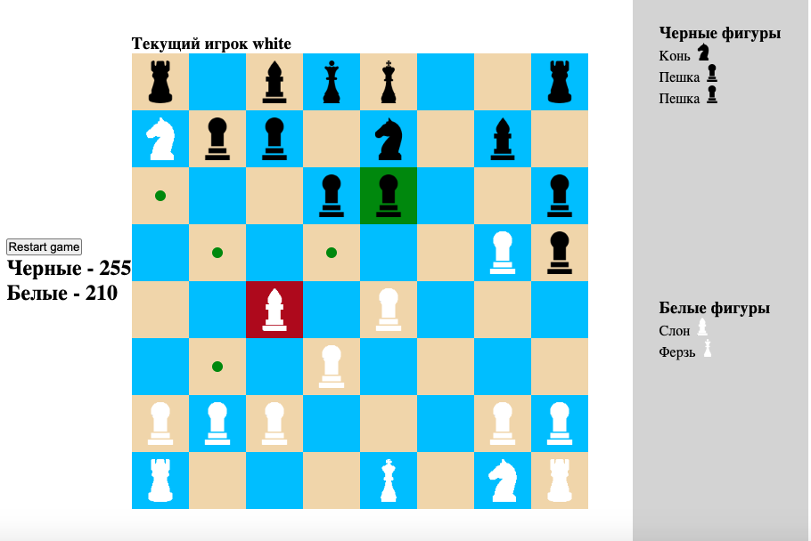

Проект доступен по ссылке - https://chess-react-typescript.vercel.app/

## Стек   

- React  
- Typescript  
- CSS Modules

Приложение выполненно с помощью ООП и функциональных компонентов. 

Реализована логика перемещения всех фигур, определения доступных ячеек для хода, передачи хода, сохранения съеденных фигур, перезагрузки игры.

### Функционал приложения: 

Игра шахматы

    

  

